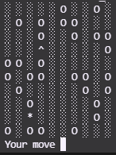
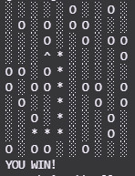

# IT Career Switch - Find the Hat
### CodeCademy | Full-Stack Engineer | JavaScript Syntax, Part III

## Description
Node.js game, entry point through command line. Game objective is to find the hat and avoid holes on grid based map.

## Start the game
Terminal => node app.js

## Environment variables
app.js => file bottom => game.generateField();

## Game controlls
* u - up
* r - right
* d - down
* l - left

## Improvements
* Ask at start of the game how big the map player wants
* After loosing the game ask if player wants to start new game
* Create Web App out of this
* [Solved] Have the character start on a random location that’s not the upper-left corner.
* Create a “hard mode” where one or more holes are added after certain turns.
* Improve your game’s graphics and interactivity in the terminal. There are many helpful packages to assist with this, and you can really get creative with how you approach terminal games.
* Create a field validator to ensure that the field generated by Field.generateField() can actually be solved. This might be pretty difficult! You’ll essentially be creating a version of a maze solver.
